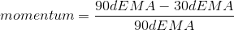
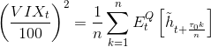

# Coinberg Cryptocurrency Hackathon

## Bitcoin Fear & Greed Index

### Introduction

(This project is not complete yet)

This is an attempt to create a sentiment index for Bitcoin. This sentiment index can be used for the purpose of trading into bitcoins and also as an indicator of overall mood. I have broadly divided the components of this index in two categories as follows.

**Market Sentiment**
 - Momentum
 - Price / MA
 - Implied Volatility (VIX)
 - Simulated Price (using Geometric Brownian Motion)
 
**Social Sentiment**
 - Google search trend
 - News articles
  

### Methodology
***

Data points that are used for creating this index are from 1 May 2018 to 31 May 2018. This project is only for PoC purpose. The limitation of the dataset is majorly due to non availability of historical social sentiment data with free api's. 

The methodology used to compute various factors is stated below. The construction methodology used to combine all the indicators is from Market Mood Index by Smallcase (http://mmi.smallcase.com/). In this project to arrive at the Greed and Fear Index we calculate the trailing 45day average for all indicators and then calculate the deviation of current value from its 45day average in terms of standard deviation. We then take a simple equally weighted average and multiply it by 100 to arrive at final Index value.

- **Momentum**: Momentum is calculated as
 

- **Implied Volatility**: Volatility Index is calculated using forecasted volatility using GARCH(1,1) model. Forecast for next 24 periods of volatility is made and calculated as 
 
  Refrence: Hao, J., & Zhang, J. E. (2013). GARCH option pricing models, the CBOE VIX, and variance risk premium. Journal of Financial Econometrics, 11(3), 556-580.

- **Price / 125d MA** : Indicator of whether the current market price is above or below the long term moving average.

- **Google Search Trend**: Interest over time from google trends for the keyword 'bitcoin'

- **News**: Sentiment analysis using vaderSentiment api of news articles with 'bitcoin' keyword in their title

- **Twitter** : Sentiment analysis for tweets by influencers in a particular currency or market. (could not cover due to unavailability of data)

- **Reddit**: Top posts titles in subreddit r/bitcoin are captured and sentiment analysis using vaderSentiment is performed

The presentation for this notebook can be accessed at https://prezi.com/p/kzkityadxbgv/

